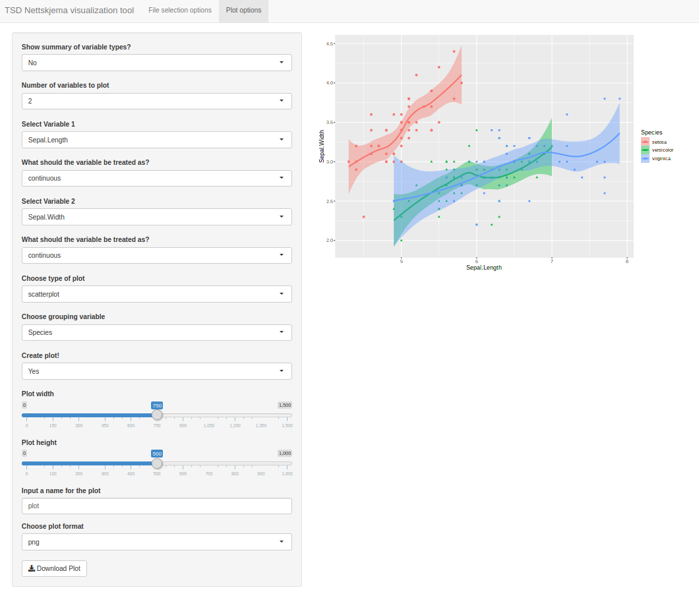

# TSD nettskjema Visualization



A shiny app that allows you to summarize nettskjema data in TSD (or other CSV files).
The 'base' software lets you visualize up to two variables together, with one grouping variable,
with different options depending on the nature of the variable (e.g. if continuous or categorical).
The resulting plot dimensions can be adjusted with sliders, and saved in a variety of image formats.

## Getting started

Download app.R and either
a) highlight all code and run (e.g. `ctrl + A` and `ctrl + enter`)
b) create a windows batch file (`.bat`) that will execute `app.R` when double-clicked
(Note: will be added to the repo).

### Preqrequisites


For the 'base' software, the following packages are necessary
```
shiny
ggplot2
dplyr
```

These can be installed through
`install.packages("<name_of_package>")`
